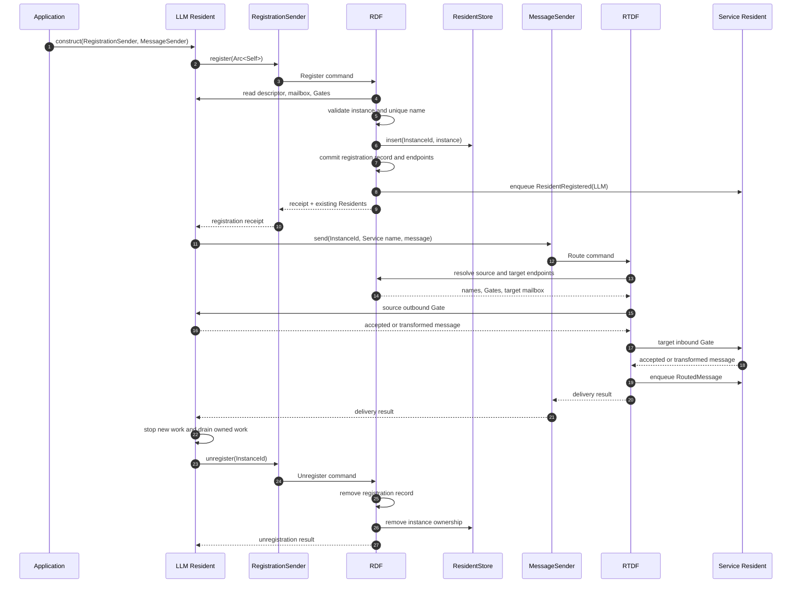

# Norma Harness

[English](#english) · [中文](#中文)

## English

Norma Harness connects independently operated services called **Residents** through two narrow data flows.

- **RDF (Registration Data Flow)** is the sole registration authority. It checks Resident names, owns successfully registered instances through its private ResidentStore, records public endpoints, and announces new registrations.
- **RTDF (Runtime Data Flow)** carries one message from a registered source to a registered target through the source outbound Gate, target inbound Gate, and target mailbox.
- **NormaHarness** is the composition root. It starts RDF and RTDF and supplies the two channel-only handles that applications inject into Residents.

Each Resident still controls its own business execution, state, dependencies, retries, cancellation, fallback, rollback, and safe shutdown boundary.

### Sequence



### Ownership and dependency direction

```text
NormaHarness
├── owns ──▶ RDF
│            └── owns ──▶ ResidentStore
│                           └── owns ──▶ Resident instance
└── owns ──▶ RTDF
             └── reads ──▶ RDF directory

Resident instance
├── owns ──▶ RegistrationSender ──▶ channel only
└── owns ──▶ MessageSender      ──▶ channel only
```

`RegistrationSender` does not own RDF. `MessageSender` does not own RTDF. The RDF and RTDF command loops hold only `Weak` references to their cores and do not store self-capturing task handles. Therefore the framework introduces no strong path from a stored Resident back to RDF or RTDF.

Injection is deliberately narrow:

```rust
let harness = NormaHarness::new();
let registration = harness.registration_sender();
let messages = harness.message_sender();

let resident = Arc::new(MyResident::new(
    registration.clone(),
    messages,
));

let receipt = registration.register(resident).await?;
```

The registration request carries the real `Arc<dyn Resident>`. RDF reads the descriptor, mailbox, and Gates from that instance. After the same-name check succeeds, RDF assigns a non-reusable `ResidentInstanceId`, inserts the instance into ResidentStore, and commits the registration record in the same command. A rejected instance is not retained.

RDF records the mailbox and Gate addresses required for delivery. RTDF reads those immutable registration endpoints directly from RDF and never opens ResidentStore or calls Resident business methods.

### Registration and shutdown contract

Registration is initiated by the Resident when its public endpoints are ready. Unregistration is its final framework action:

```text
construct Resident with channel handles
→ Resident submits itself for registration
→ Resident performs its work
→ Resident stops accepting new work
→ Resident drains or cancels work it owns
→ Resident unregisters
→ RDF removes both registration and Store ownership
→ Resident execution returns
```

RDF does not wait for `Resident::run` during unregistration. Otherwise the Resident could wait for RDF while RDF waited for the same Resident to finish. Sending `unregister` is the Resident's declaration that its own shutdown boundary has been reached.

An RTDF delivery that already copied its endpoint handles may finish concurrently with unregistration. A concrete Resident must close or guard its mailbox and Gates as part of its own shutdown boundary.

### Explicitly out of scope

Norma Harness does not provide sessions, threads, turns, workflow execution, context compression, state machines, checkpoints, persistence, retry policies, cancellation policies, rollback, recovery, durable execution, Ledger, WASM hosting, hot-update activation, version rollback, or business result interpretation.

See [Architecture](docs/ARCHITECTURE.md) for the complete invariants and module boundaries.

## 中文

Norma Harness 通过两个范围明确的数据流连接称为 **Resident** 的独立服务。

- **RDF（Registration Data Flow，注册数据流）**是唯一注册权威。它审核 Resident 名称，通过内部 ResidentStore 持有注册成功的实例，保存公开端点，并广播新注册事件。
- **RTDF（Runtime Data Flow，运行数据流）**负责一跳消息传递，固定经过源 Resident 的传出 Gate、目标 Resident 的传入 Gate和目标邮箱。
- **NormaHarness** 是组合根。它启动 RDF 和 RTDF，并提供两个仅包含通道发送端的句柄，由应用注入 Resident。

每个 Resident 仍然自行控制业务执行、状态、依赖、重试、取消、回退、回滚和安全退出边界。

### 时序

上面的时序图同时描述中文版流程：应用只向 Resident 注入两个通道 Sender；Resident 准备完成后把真实实例提交给 RDF；RDF 在一次注册命令中完成同名审核、实例保存和注册记录提交；RTDF 只通过 RDF 保存的端点传递消息；Resident 最后主动注销，RDF 同时删除注册和实例所有权。

### 所有权与依赖方向

```text
NormaHarness
├── 持有 ──▶ RDF
│            └── 持有 ──▶ ResidentStore
│                           └── 持有 ──▶ Resident 实例
└── 持有 ──▶ RTDF
             └── 只读 ──▶ RDF 注册目录

Resident 实例
├── 持有 ──▶ RegistrationSender ──▶ 仅通道
└── 持有 ──▶ MessageSender      ──▶ 仅通道
```

`RegistrationSender` 不持有 RDF，`MessageSender` 不持有 RTDF。RDF 和 RTDF 的命令循环只持有核心对象的 `Weak`，也不保存捕获自身的任务句柄。因此框架中不存在从 Store 内 Resident 返回 RDF 或 RTDF 的强引用路径。

注入接口保持最小：

```rust
let harness = NormaHarness::new();
let registration = harness.registration_sender();
let messages = harness.message_sender();

let resident = Arc::new(MyResident::new(
    registration.clone(),
    messages,
));

let receipt = registration.register(resident).await?;
```

注册请求携带真实的 `Arc<dyn Resident>`。RDF 直接从该实例读取描述、邮箱和 Gate。同名审核通过后，RDF 分配不可复用的 `ResidentInstanceId`，把实例写入 ResidentStore，并在同一条注册命令中提交注册记录。被拒绝的实例不会被 Store 保留。

RDF 的注册记录直接保存消息传递所需的邮箱和 Gate 地址。RTDF 从 RDF 读取这些端点，不访问 ResidentStore，也不调用 Resident 的业务方法。

### 注册与退出约定

Resident 在公开端点准备完成时主动注册。注销是它最后一次框架操作：

```text
使用两个通道句柄构造 Resident
→ Resident 提交自己完成注册
→ Resident 正常工作
→ Resident 停止接收新工作
→ Resident 排空或取消自己拥有的工作
→ Resident 主动注销
→ RDF 同时删除注册记录和 Store 所有权
→ Resident 执行返回
```

RDF 注销时不会等待 `Resident::run` 结束，否则会形成 Resident 等待 RDF、RDF 又等待 Resident 的执行死锁。Resident 发送 `unregister` 就是在声明它已经到达自己的安全退出边界。

已经从 RDF 复制了端点句柄的 RTDF 投递可能与注销并发结束。具体 Resident 必须在自己的退出边界中关闭或保护邮箱和 Gate。

### 明确不做

Norma Harness 不提供 Session、Thread、Turn、工作流执行、上下文压缩、状态机、检查点、持久化、重试策略、取消策略、回滚、恢复、durable execution、Ledger、WASM Host、热更新激活、版本回退或业务结果解释。

完整约束见[架构说明](docs/ARCHITECTURE.md)。
