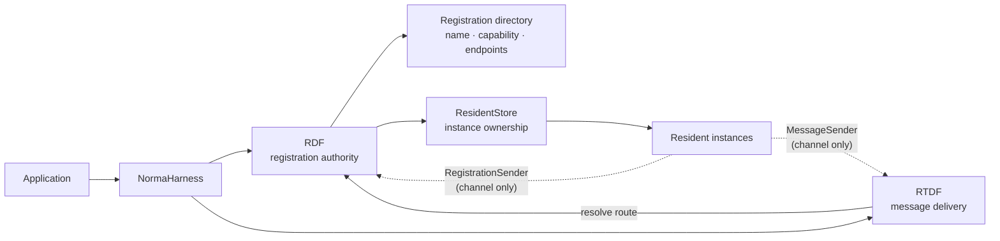
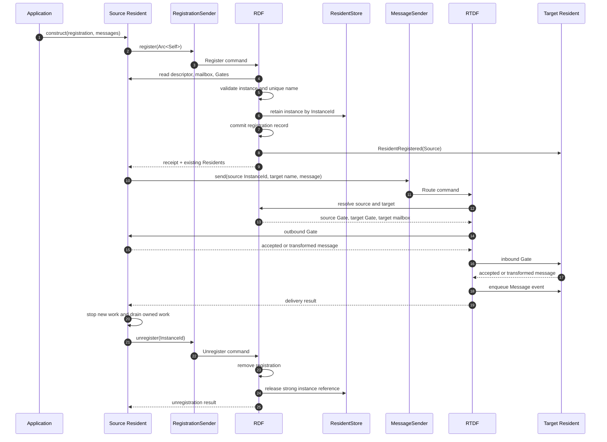

# Norma Harness

**English** | [简体中文](./README.zh-CN.md)

Norma Harness is a small Rust library for connecting independently implemented, in-process services called **Residents**.

It defines two data flows:

- **RDF (Registration Data Flow)** registers Residents, enforces unique names, publishes capabilities and delivery endpoints, and announces new registrations.
- **RTDF (Runtime Data Flow)** moves one message from a registered source to a registered target through a fixed delivery path.

A Resident keeps control of its own execution model, state, concurrency, dependencies, retry policy, cancellation, rollback, and shutdown boundary. Norma Harness only provides registration and one-hop delivery.

## Architecture



`NormaHarness` is the composition root. It starts RDF and RTDF and gives the application two cloneable channel handles to inject into Residents. The handles do not own RDF, RTDF, the Store, or the application object.

| Component | Responsibility |
| --- | --- |
| `Resident` | Implements one service and exposes its name, capabilities, mailbox, and optional Gates. |
| `NormaHarness` | Constructs and owns the framework data flows and exposes their narrow entry points. |
| `RDF` | Serializes registration changes, enforces name uniqueness, maintains the public directory, and announces new Residents. |
| `ResidentStore` | Strongly owns successfully registered Resident instances by instance ID. It is private framework storage. |
| `RTDF` | Resolves one target and performs one-hop delivery. It does not execute Resident business logic. |
| `Gate` | Optionally validates or transforms a message at a Resident-owned transport boundary. |
| `Mailbox` | Accepts a `ResidentEvent` by enqueueing it for later Resident processing. |

The model has four core invariants:

1. A Resident name identifies at most one live registration.
2. Every successful registration receives a process-local, non-reusable `ResidentInstanceId`.
3. A message always passes through the source outbound Gate, the target inbound Gate, and then the target mailbox.
4. Business state and business lifecycle remain inside the concrete Resident.

## Add the dependency

For a Git dependency:

```toml
[dependencies]
norma-harness = { git = "https://github.com/Heyu2002/NormaHarness" }
serde_json = "1"
tokio = { version = "1", features = ["macros", "rt-multi-thread"] }
```

`NormaHarness::new()` starts background tasks and must be called inside a Tokio runtime.

## Minimal example

The example below defines a Resident that owns the two injected framework ports, registers itself when ready, sends one message, and unregisters only after its own work has stopped.

```rust
use std::{error::Error, sync::Arc};

use norma_harness::{
    CapabilityKey, FlowMessage, IdentifierError, Mailbox, MailboxAddress,
    MailboxError, MessageKind, MessageSender, NormaHarness, RegistrationError,
    RegistrationReceipt, RegistrationSender, Resident, ResidentDescriptor,
    ResidentEvent, ResidentInstanceId, ResidentKey, RouteError,
};
use serde_json::json;

struct PrintMailbox;

impl Mailbox for PrintMailbox {
    fn deliver(&self, event: ResidentEvent) -> Result<(), MailboxError> {
        // A real mailbox should enqueue and return immediately.
        println!("{event:?}");
        Ok(())
    }
}

struct Service {
    descriptor: ResidentDescriptor,
    mailbox: MailboxAddress,
    registration: RegistrationSender,
    messages: MessageSender,
}

impl Service {
    fn new(
        name: &str,
        capability: &str,
        registration: RegistrationSender,
        messages: MessageSender,
    ) -> Result<Self, IdentifierError> {
        Ok(Self {
            descriptor: ResidentDescriptor::new(
                ResidentKey::new(name)?,
                [CapabilityKey::new(capability)?],
            ),
            mailbox: Arc::new(PrintMailbox),
            registration,
            messages,
        })
    }

    async fn register(
        self: &Arc<Self>,
    ) -> Result<RegistrationReceipt, RegistrationError> {
        self.registration.register(Arc::clone(self)).await
    }

    async fn send(
        &self,
        instance_id: ResidentInstanceId,
        target: &ResidentKey,
    ) -> Result<(), RouteError> {
        self.messages
            .send(
                instance_id,
                target,
                FlowMessage::new(
                    MessageKind::new("request").expect("static message kind"),
                    json!({ "prompt": "store this value" }),
                ),
            )
            .await
    }

    async fn unregister(
        &self,
        instance_id: ResidentInstanceId,
    ) -> Result<(), RegistrationError> {
        self.registration.unregister(instance_id).await.map(|_| ())
    }
}

impl Resident for Service {
    fn descriptor(&self) -> ResidentDescriptor {
        self.descriptor.clone()
    }

    fn mailbox(&self) -> MailboxAddress {
        self.mailbox.clone()
    }
}

#[tokio::main]
async fn main() -> Result<(), Box<dyn Error>> {
    let harness = NormaHarness::new();
    let registration = harness.registration_sender();
    let messages = harness.message_sender();

    let llm = Arc::new(Service::new(
        "llm",
        "generate",
        registration.clone(),
        messages.clone(),
    )?);
    let storage = Arc::new(Service::new(
        "storage",
        "store",
        registration,
        messages,
    )?);

    let llm_receipt = llm.register().await?;
    let storage_receipt = storage.register().await?;
    let storage_key = storage.descriptor().key().clone();

    llm.send(llm_receipt.instance_id(), &storage_key).await?;

    // Each Resident reaches its own safe shutdown boundary first.
    llm.unregister(llm_receipt.instance_id()).await?;
    storage
        .unregister(storage_receipt.instance_id())
        .await?;

    Ok(())
}
```

## Registration and delivery sequence



## Registration contract

A Resident registers when all of its public endpoints are ready. The registration request carries the real `Arc<dyn Resident>`, so RDF reads the descriptor, mailbox, and Gates from the instance instead of trusting a separately assembled record.

A successful `RegistrationReceipt` contains:

- the assigned `ResidentInstanceId`;
- a snapshot of Residents that were already registered;
- any failures encountered while notifying existing Residents about the newcomer.

RDF is the only same-name authority. Concurrent attempts to register the same name are serialized, and only one can succeed. A notification failure is reported in the receipt; it does not roll back the new registration or remove the Resident whose mailbox rejected the notice.

The descriptor and delivery endpoints must remain stable until unregistration. A service that needs a different public identity or different endpoints should retire the old registration and register a new instance.

## Routing contract

A send request contains three values:

```text
source ResidentInstanceId
target ResidentKey
FlowMessage { kind, JSON payload }
```

RTDF performs exactly one hop:

```text
RDF route resolution
→ source outbound Gate
→ target inbound Gate
→ target mailbox
```

The source is identified by its exact instance ID. Reusing the same Resident name later does not revive an old ID. The target is selected by its current unique name.

Both Gates may accept, reject, or transform the message. The mailbox receives a `ResidentEvent::Message(RoutedMessage)` only after both Gates succeed. Gate or mailbox failure ends that delivery and returns a `RouteError`; it does not change either Resident's registration.

`Mailbox::deliver` is synchronous by design and should only enqueue an event. Resident business work should run in the Resident's own task or executor.

## Lifetime and concurrency

Unregistration is the Resident's final framework operation:

```text
stop accepting new work
→ drain or cancel Resident-owned work
→ close or guard public endpoints
→ unregister the exact InstanceId
→ return from Resident execution
```

RDF does not wait for a Resident execution function during unregistration. Waiting in both directions would create a lifecycle deadlock. Removing a Store reference also does not force object destruction: unrelated `Arc` references may keep the Rust value alive, but the old instance no longer has a valid RDF identity and cannot start new RTDF sends.

A delivery that already copied its Gate and mailbox handles may finish concurrently with unregistration. Each Resident must make late calls safe at its own shutdown boundary.

RDF processes registration commands serially. RTDF dispatches deliveries independently, so a Gate may await or initiate another send without blocking one global delivery loop. Dropping `NormaHarness` shuts down the framework cores even if cloned Sender handles still exist.

## Resident implementations

The [`norma-residents`](./residents/README.md) package holds
concrete Resident implementations. Its `codex` module runs the locally
authenticated Codex CLI as a Resident. It uses
`codex app-server` over stdio, defaults to `gpt-6-luna`, and returns results
through RTDF. It keeps Codex thread state, execution, and shutdown inside the
concrete Resident rather than adding them to RDF or RTDF.

```console
cargo run -p norma-residents --example roundtrip -- . "Summarize this repository in one sentence."
```

## Resident chat room

The `norma-web` package serves a local chat website. It discovers Residents
advertising the `llm` capability through RDF and lists online models directly
in the sidebar. Clicking a model opens or reuses its one-to-one room. Group
creation selects at least two different online Residents. Without a mention,
members contribute in sequence and the first member synthesizes the result.
With `@member` or `@{member}`, only the named group members reply. Each Resident
keeps a separate provider thread for each room and receives messages from its
other ordinary rooms; incognito rooms use only their own context. Requests and replies travel through
RTDF, while the `residents::chat` Resident owns room state.
Each `llm.turn.request` includes an `origin` with `solo` or `group` kind,
room ID, and room name. The LLM inbound Gate validates this origin and stamps
`source_resident` from RTDF. Codex receives a JSON context envelope with
`source`, `new_events`, and `current_request`. A separate `tools.rooms`
Resident provides the `list_group_members` dynamic tool through Codex
app-server. It queries `chat.rooms` over RTDF and is limited to the current
group. Codex dynamic tools are experimental.

Sign in with `codex login`, then run from the repository root:

```console
cargo run -p norma-web
```

Open <http://127.0.0.1:3000> locally, or use the host's IPv4 address and port
from another device on the same LAN. The app starts one Codex Resident, using
`gpt-6-luna` with the local Codex reasoning effort in read-only mode. The `CodexResident` implementation also allows
only one active instance per process. `NORMA_CODEX_CWD` sets the working directory, and `NORMA_WEB_BIND` sets
the listen address. Set `NORMA_CODEX_EFFORT` to change reasoning effort, or
`NORMA_CODEX_WORKSPACE_WRITE=1` to allow edits. The
default listener binds all IPv4 interfaces. Set `NORMA_WEB_BIND=127.0.0.1:3000`
to limit access to this machine. There is no user authentication yet, so expose
the site only on a trusted network. Ordinary rooms, messages, attachments, and
provider thread mappings are saved locally under `%LOCALAPPDATA%\NormaHarness` on Windows,
or the XDG/HOME data directory elsewhere. Set `NORMA_DATA_DIR` to override it.
Rooms retain their IDs after page close, idle sleep, and process restart. The idle threshold
is `NORMA_THREAD_IDLE_SECS` (default 1800). The sidebar supports recent and archived chats.
If a provider thread cannot resume, the Resident rebuilds context from saved messages.
Long-term memory is off by default and can be enabled in the sidebar. It extracts facts
only after room sleep (following any configured end hook) or provider context compaction.
Facts persist on disk, frequent mentions enter cache, and sustained cache facts enter hot memory.
Incognito rooms are excluded from Norma's chat and memory files, with attachments in a temporary
directory. The model provider and operating system may retain processing records. Because the
website has no user authentication, the memory setting applies to this local service instance.
With one online
model, solo chat works; group creation becomes available when another distinct
LLM Resident is registered.

Additional implementations can join by advertising `llm` and handling the
[`llm.turn.request` / `llm.turn.result` contract](./residents/src/llm.rs).
Codex also retains the older `codex.turn.*` protocol.

## Repository layout

```text
src/
├── application.rs     # composition root and injected ports
├── rdf.rs             # registration commands and directory
├── resident_store.rs  # strong ownership of registered instances
├── rtdf.rs            # one-hop delivery pipeline
├── resident.rs        # Resident interface and registration events
├── gate.rs            # outbound and inbound message boundaries
├── mailbox.rs         # Resident-owned delivery address
├── message.rs         # flow and routed messages
├── id.rs              # names, capability keys, and instance IDs
└── error.rs           # boundary errors
```

The detailed invariants are documented in [`docs/ARCHITECTURE.md`](./docs/ARCHITECTURE.md).

## Development

```console
cargo test --workspace --all-targets
cargo clippy --workspace --all-targets -- -D warnings
cargo fmt --all -- --check
```

## License

Apache-2.0.
