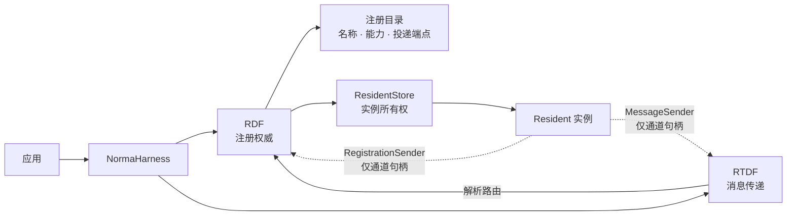
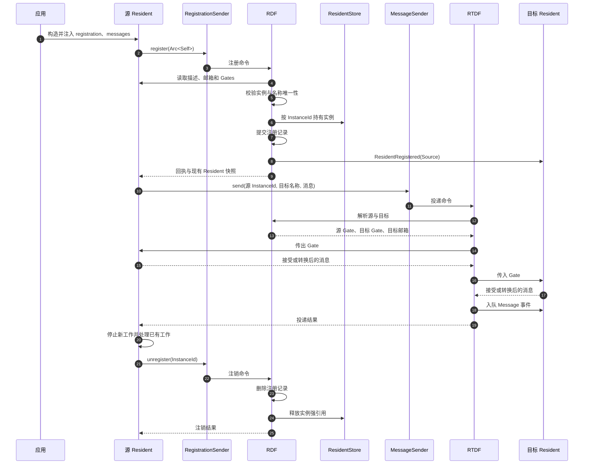

# Norma Harness

[English](./README.md) | **简体中文**

Norma Harness 是一个小型 Rust 库，用于连接在同一进程内独立实现的服务。项目把这些服务称为 **Resident**。

框架只定义两条数据流：

- **RDF（Registration Data Flow，注册数据流）**负责 Resident 注册、同名审核、能力与投递端点登记，以及新 Resident 上线通知。
- **RTDF（Runtime Data Flow，运行数据流）**负责把一条消息从已注册的源 Resident 传递到已注册的目标 Resident。

Resident 自己控制执行模型、业务状态、并发、依赖、重试、取消、回退、回滚和安全退出边界。Norma Harness 只提供注册与单跳消息传递。

## 架构



`NormaHarness` 是组合根。它启动 RDF 与 RTDF，并向应用提供两个可克隆的通道句柄，由应用在构造 Resident 时注入。句柄不持有 RDF、RTDF、ResidentStore 或整个应用对象。

| 组件 | 职责 |
| --- | --- |
| `Resident` | 实现一个独立服务，对外暴露名称、能力、邮箱和可选 Gate。 |
| `NormaHarness` | 创建并持有框架数据流，提供最小注入入口。 |
| `RDF` | 串行处理注册变更，审核同名，维护公开注册目录，广播新 Resident。 |
| `ResidentStore` | 按实例 ID 强持有注册成功的 Resident，是框架内部存储。 |
| `RTDF` | 解析一个目标并完成单跳投递，不执行业务逻辑。 |
| `Gate` | Resident 自己拥有的传输边界，可以校验或转换消息。 |
| `Mailbox` | 将 `ResidentEvent` 入队，交给 Resident 稍后处理。 |

整个模型依赖四条核心约束：

1. 同一个 Resident 名称最多对应一个存活的注册。
2. 每次成功注册都会得到一个进程内不可复用的 `ResidentInstanceId`。
3. 消息固定经过源 Resident 的传出 Gate、目标 Resident 的传入 Gate 和目标邮箱。
4. 业务状态与业务生命周期始终留在具体 Resident 内部。

## 添加依赖

通过 Git 仓库引用：

```toml
[dependencies]
norma-harness = { git = "https://github.com/Heyu2002/NormaHarness" }
serde_json = "1"
tokio = { version = "1", features = ["macros", "rt-multi-thread"] }
```

`NormaHarness::new()` 会启动后台任务，因此必须在 Tokio runtime 内调用。

## 最小示例

下面的示例定义了一个持有两个注入端口的 Resident。它在准备完成后主动注册自己，发送一条消息，并在自己的工作完全停止后执行注销。

```rust
use std::{error::Error, sync::Arc};

use norma_harness::{
    CapabilityKey, FlowMessage, IdentifierError, Mailbox, MailboxAddress,
    MailboxError, MessageKind, MessageSender, NormaHarness, RegistrationError,
    RegistrationReceipt, RegistrationSender, Resident, ResidentDescriptor,
    ResidentEvent, ResidentInstanceId, ResidentKey, RouteError,
};
use serde_json::json;

struct PrintMailbox;

impl Mailbox for PrintMailbox {
    fn deliver(&self, event: ResidentEvent) -> Result<(), MailboxError> {
        // 真实邮箱应当只完成入队，然后立即返回。
        println!("{event:?}");
        Ok(())
    }
}

struct Service {
    descriptor: ResidentDescriptor,
    mailbox: MailboxAddress,
    registration: RegistrationSender,
    messages: MessageSender,
}

impl Service {
    fn new(
        name: &str,
        capability: &str,
        registration: RegistrationSender,
        messages: MessageSender,
    ) -> Result<Self, IdentifierError> {
        Ok(Self {
            descriptor: ResidentDescriptor::new(
                ResidentKey::new(name)?,
                [CapabilityKey::new(capability)?],
            ),
            mailbox: Arc::new(PrintMailbox),
            registration,
            messages,
        })
    }

    async fn register(
        self: &Arc<Self>,
    ) -> Result<RegistrationReceipt, RegistrationError> {
        self.registration.register(Arc::clone(self)).await
    }

    async fn send(
        &self,
        instance_id: ResidentInstanceId,
        target: &ResidentKey,
    ) -> Result<(), RouteError> {
        self.messages
            .send(
                instance_id,
                target,
                FlowMessage::new(
                    MessageKind::new("request").expect("静态消息类型合法"),
                    json!({ "prompt": "store this value" }),
                ),
            )
            .await
    }

    async fn unregister(
        &self,
        instance_id: ResidentInstanceId,
    ) -> Result<(), RegistrationError> {
        self.registration.unregister(instance_id).await.map(|_| ())
    }
}

impl Resident for Service {
    fn descriptor(&self) -> ResidentDescriptor {
        self.descriptor.clone()
    }

    fn mailbox(&self) -> MailboxAddress {
        self.mailbox.clone()
    }
}

#[tokio::main]
async fn main() -> Result<(), Box<dyn Error>> {
    let harness = NormaHarness::new();
    let registration = harness.registration_sender();
    let messages = harness.message_sender();

    let llm = Arc::new(Service::new(
        "llm",
        "generate",
        registration.clone(),
        messages.clone(),
    )?);
    let storage = Arc::new(Service::new(
        "storage",
        "store",
        registration,
        messages,
    )?);

    let llm_receipt = llm.register().await?;
    let storage_receipt = storage.register().await?;
    let storage_key = storage.descriptor().key().clone();

    llm.send(llm_receipt.instance_id(), &storage_key).await?;

    // 每个 Resident 先到达自己的安全退出边界。
    llm.unregister(llm_receipt.instance_id()).await?;
    storage
        .unregister(storage_receipt.instance_id())
        .await?;

    Ok(())
}
```

## 注册与消息投递时序



## 注册约定

Resident 应在所有公开端点准备完成后注册。注册请求携带真实的 `Arc<dyn Resident>`，RDF 直接从实例读取描述、邮箱和 Gate，不接受调用方另外拼装一份可能失真的注册记录。

成功返回的 `RegistrationReceipt` 包含：

- 本次注册分配的 `ResidentInstanceId`；
- 注册前已经存在的 Resident 快照；
- 向现有 Resident 广播新注册事件时发生的通知失败。

RDF 是唯一的同名审核点。并发注册同一个名称时，注册命令会被串行处理，最终只能有一个实例成功。广播通知失败会记录在回执中，不会回滚新注册，也不会删除邮箱拒绝通知的 Resident。

从注册成功到注销完成，Resident 的描述和投递端点必须保持稳定。需要变更公开身份或端点时，应先让旧注册安全退出，再注册一个新实例。

## 消息传递约定

一次发送只包含三个核心值：

```text
源 ResidentInstanceId
目标 ResidentKey
FlowMessage { 消息类型, JSON 载荷 }
```

RTDF 只执行一次单跳投递：

```text
RDF 解析路由
→ 源 Resident 传出 Gate
→ 目标 Resident 传入 Gate
→ 目标 Resident 邮箱
```

源 Resident 必须提供本次注册对应的准确实例 ID。旧实例注销后，即使新实例复用了相同名称，旧 ID 也不会重新生效。目标 Resident 按当前唯一名称查找。

两个 Gate 都可以接受、拒绝或转换消息。只有两个 Gate 都成功后，目标邮箱才会收到 `ResidentEvent::Message(RoutedMessage)`。Gate 或邮箱失败只终止本次投递并返回 `RouteError`，不会改变任何 Resident 的注册状态。

`Mailbox::deliver` 是同步接口，只应该完成入队。具体业务处理应当在 Resident 自己的任务或执行器中进行。

## 生命周期与并发

注销是 Resident 最后一次框架操作：

```text
停止接收新工作
→ 排空或取消 Resident 自己拥有的工作
→ 关闭或保护公开端点
→ 注销准确的 InstanceId
→ Resident 执行返回
```

RDF 在注销时不会等待 Resident 的执行函数结束，否则容易形成双方相互等待的生命周期死锁。Store 删除强引用也不等于强制销毁 Rust 对象：其它 `Arc` 仍可能让旧对象存活，但它已经失去 RDF 注册身份，无法再用旧实例 ID 发起新的 RTDF 消息。

已经从 RDF 复制了 Gate 和邮箱句柄的投递可能与注销并发结束。具体 Resident 必须在自己的退出边界内保证迟到调用能够安全失败或安全完成。

RDF 串行处理注册命令。RTDF 独立调度每次投递，因此 Gate 可以等待异步操作，也可以再次发起消息，不会阻塞一个全局串行投递循环。即使外部仍保留 Sender 克隆，释放 `NormaHarness` 也会关闭框架核心。

## 明确不做

Norma Harness 不提供：

- Session、Thread、Turn 或上下文压缩；
- 工作流编排或业务结果解释；
- 通用状态机；
- 检查点、持久化、Ledger 或 durable execution；
- 框架级重试、取消、补偿、回退或回滚策略；
- Resident Factory、Resident Host、WASM Host 或 ABI；
- 热更新激活、版本化发布或历史版本回退；
- 多跳路由、远程传输或网络服务发现。

这些能力可以由具体 Resident 或独立上层模块实现，不需要扩张 RDF 与 RTDF 的边界。

## 仓库结构

```text
crates/norma-harness/src/
├── application.rs     # 组合根与注入端口
├── rdf.rs             # 注册命令与注册目录
├── resident_store.rs  # 注册实例的强所有权
├── rtdf.rs            # 单跳消息管道
├── resident.rs        # Resident 接口与注册事件
├── gate.rs            # 传入与传出消息边界
├── mailbox.rs         # Resident 自己拥有的投递地址
├── message.rs         # 原始消息与路由消息
├── id.rs              # 名称、能力键与实例 ID
└── error.rs           # 边界错误
```

更完整的不变量与模块边界见[`docs/ARCHITECTURE.md`](./docs/ARCHITECTURE.md)。

## 开发

```console
cargo test --workspace --all-targets
cargo clippy --workspace --all-targets -- -D warnings
cargo fmt --all -- --check
```

## 许可证

Apache-2.0。
